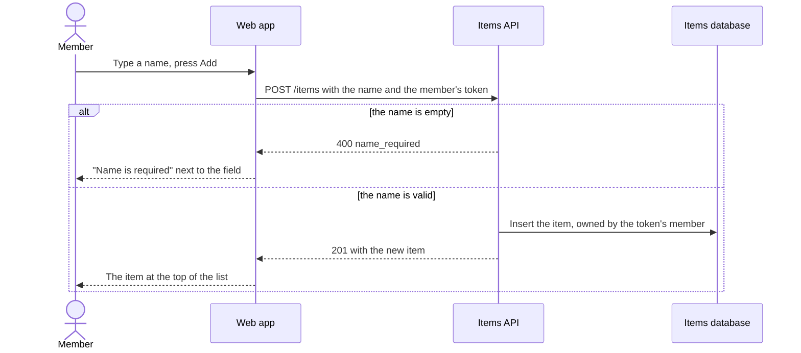
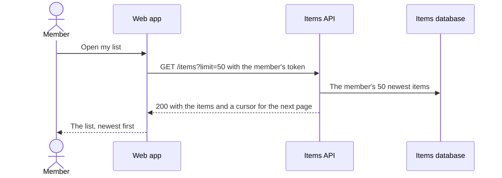
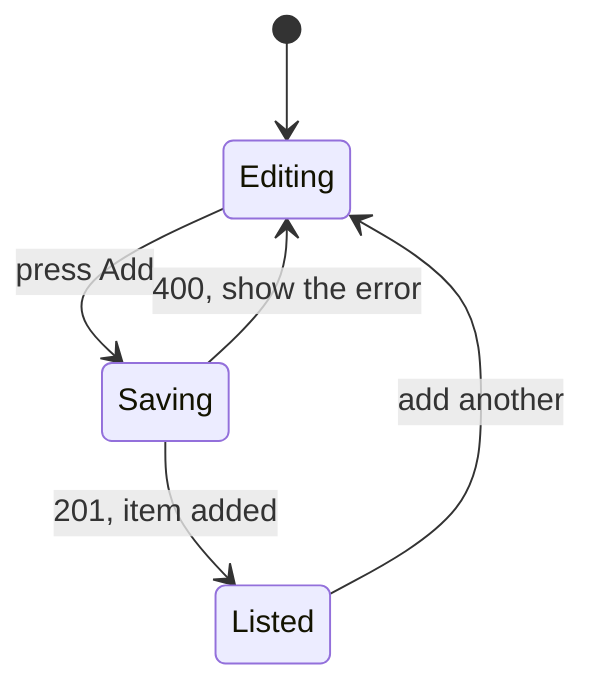

# {{title}}: workflows

Each workflow names the user story it implements.

## Add an item (US-1)

```mermaid
sequenceDiagram
  actor M as Member
  participant W as Web app
  participant A as Items API
  participant D as Items database
  M->>W: Type a name, press Add
  W->>A: POST /items with the name and the member's token
  alt the name is empty
    A-->>W: 400 name_required
    W-->>M: "Name is required" next to the field
  else the name is valid
    A->>D: Insert the item, owned by the token's member
    A-->>W: 201 with the new item
    W-->>M: The item at the top of the list
  end
```

## See my items (US-2)

```mermaid
sequenceDiagram
  actor M as Member
  participant W as Web app
  participant A as Items API
  participant D as Items database
  M->>W: Open my list
  W->>A: GET /items?limit=50 with the member's token
  A->>D: The member's 50 newest items
  A-->>W: 200 with the items and a cursor for the next page
  W-->>M: The list, newest first
```

## The add form

```mermaid
stateDiagram-v2
  [*] --> Editing
  Editing --> Saving: press Add
  Saving --> Editing: 400, show the error
  Saving --> Listed: 201, item added
  Listed --> Editing: add another
```
